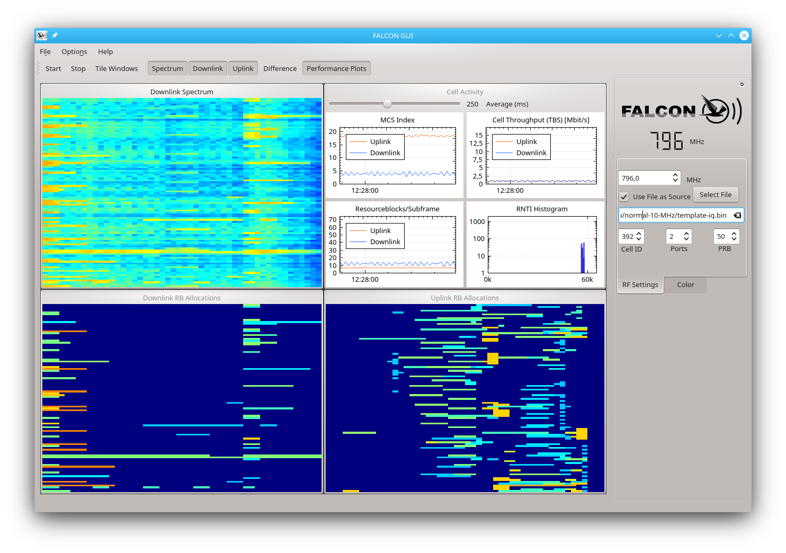

FALCON - Fast Analysis of LTE Control channels
==============================================


**FALCON** is an open-source software collection for real-time analysis of radio resources in private or commercial LTE/LTE-A networks. Based on [srsLTE library][srslte] v18.12, the software can be run on a plain x86 general-purpose PCs with any compatible SDR.


The research around this project has been supported by *Deutsche Forschungsgemeinschaft* (DFG) within the Collaborative Research Center SFB 876
“Providing Information by Resource-Constrained Analysis”, project A4 at TU Dortmund University.

A preprint of the **corresponding scientific publication** (IEEE GLOBECOM 2019) is available on ArXiV: 
https://arxiv.org/abs/1907.10110. Please see section [Acknowledgements](#acknowledgements) of how to reference this project.

## Related Software
This software is an alternative to [IMDEA OWL][imdea-owl] which provides comparable functionalities for long-term monitoring of LTE cells. Other than OWL, FALCON additionally targets use cases that require short-term monitoring, mobility or non-ideal radio conditions. For convenience purposes, the interface is mostly kept compatible with OWL and an [updated port of OWL](#comparison-with-imdea-owl) is also included in this framework.

## License
FALCON is released under the [AGPLv3 license](LICENSE).


## Key Features
* Reliable real-time monitoring public LTE cells
* Monitoring up to 20 MHz bandwidth
* FDD only
* Supported DCI formats: 0/1A, 1, 1B, 1C, 2, 2A, 2B
* Suitable for short-term and long-term monitoring with non-ideal radio conditions
* Qt-based and OpenGL-accelerated GUI for visualization of allocated resource blocks, spectrogram and cell-specific performance metrics (throughput, resource utilization, user activity, etc.).
* Synchronized recorder with integrated support for network probing by an auxiliary modem

Check the [changelog](CHANGELOG.md) for recently introduced updates.

### Planned Features
* TDD
* Support for DCI with Carrier Indicator Field (CIF)
* Multithreaded DCI search
* Visualization of System Information Blocks (SIB)

## Installation

### 1) Required Dependencies
FALCON installation automatically downloads a proper version of srsLTE and c-mnalib as subproject during the build process. Please install the following dependencies which are required by FALCON or its included components:

For srsLTE:
```sh
$ sudo apt-get install build-essential git subversion cmake libboost-system-dev libboost-test-dev libboost-thread-dev libqwt-dev libqt4-dev libfftw3-dev libsctp-dev libconfig-dev libconfig++-dev libmbedtls-dev
```
For srsGUI (required only for building port of IMDEA OWL):
```sh
$ sudo apt-get install libboost-system-dev libboost-test-dev libboost-thread-dev libqwt-dev libqt4-dev
$ git clone https://github.com/srsLTE/srsGUI.git
$ cd srsgui
$ mkdir build
$ cd build
$ cmake ../
$ make 
$ sudo make install
```
For USRP support:
```sh
$ sudo add-apt-repository ppa:ettusresearch/uhd
$ sudo apt-get update
$ sudo apt-get install libuhd-dev libuhd003 uhd-host
```

For LimeSDR support:
```sh
$ sudo add-apt-repository -y ppa:myriadrf/drivers
$ sudo apt-get update
$ sudo apt-get install limesuite limesuite-udev limesuite-images
$ sudo apt-get install soapysdr soapysdr-module-lms7
```

For FALCON:
```sh
$ sudo apt-get install libglib2.0-dev libudev-dev libcurl4-gnutls-dev libboost-all-dev qtdeclarative5-dev libqt5charts5-dev
```

### 2) FALCON:
```sh
$ git clone https://github.com/falkenber9/falcon.git
$ cd falcon
$ mkdir build
$ cd build
$ cmake ../
$ make
```

## Hardware Requirements / Performance
Real-time decoding of LTE signals requires a mature multicore CPU, especially when monitoring busy cells and large bandwidths (i.e. 15MHz and 20MHz cells). Large sample rates, wide FFTs, and larger search spaces make heavy use of the CPU, memory and involved buses.

In case of minor/sporadic performance issues, FALCON starts skipping/dropping single subframes in favor of maintaining synchronization if the processing of previous (buffered) subframes takes too long.
Serious performance issues lead to IQ-sample overflows and degraded synchronization which causes false detections (spurious DCI) or may even cause an entire synchronization loss.

The actual computational demands depend on many internal (CPU capabilities, memory bandwidth, power-saving techniques, other processes) and external factors (interference from neighboring cells/sectors, signal strength, cell activity).
Therefore, the following *rules of thumb* may not all be required for your setup or may not be sufficient to obtain satisfactory results.

### General Recommendations
* Don't run any other fancy (GUI) application at the same time, e.g. browser or Email clients
* Use a CPU with at least 4 physical cores
* Disable Hyper-Threading
* Disable power-saving techniques such as DVFS and put the CPU into *performance* mode

### Example Systems
All systems were tested with a USRP B210 SDR, attached via USB 3.0 and simple dipole antenna (connected via 1m SMA HF cable).
#### Lenovo X250 Notebook
* Intel Core i7-5600U (Dual Core CPU + Hyper-Threading), 2.6GHz, 8GB RAM, SSD
* Arch Linux, kernel 5.3.5-arch1-1-ARCH, KDE/Plasma desktop environment
* GUI: Good results up to 10MHz bandwidth and good LTE signal.
* FalconEye: Good results up to 15MHz bandwidth and good LTE signal.
* 20 MHz bandwidth: subframe skip ratio up to 50%, eventually sync loss, many false detections

#### Lenovo T540p
* Intel Core i7-4710Q (4 Core CPU + Hyper-Threading), 2.5GHz, 8GB RAM, SSD
* Ubuntu 18.04.3 LTS (bionic), kernel 4.15.0-66-generic, GNOME or KDE/Plasma desktop environment
* GUI: Good results up to 20MHz bandwidth and good LTE signal; frame skips during window resizing
* FalconEye: Good results up to 20MHz bandwidth and good LTE signal

## Usage Instructions
This section provides brief usage instructions for FALCON. The software collection comprises the following components:

* Falcon Decoder GUI: A visualization for online/offline PDCCH decoding
* FalconEye: A command-line version of the PDCCH decoder for automated/batch processing
* FalconCaptureProbe: Signal recorder with optional network probing
* FalconCaptureWarden: A command-line controller for synchronized recordings by multiple instances of FalconCaptureProbe
* imdea_cc_decoder: Port of IMDEA OWL's PDCCH decoder
* imdea_capture_sync: Port of IMDEA OWL's signal recorder

### FALCON GUI
The GUI version of FALCON's decoder is located in ``build/src/gui/gui``. Simply launch the executable from a terminal or from your preferred graphical file manager.
Enter the center frequency of the target LTE cell or select a recording from a file using the file chooser or drag & drop. Example files are provided in a [separate repository][examples].

Press 'Start' and the decoder immediately starts to synchronize to the cell and decodes the PDCCH.
The GUI will display waterfall plots of the spectrum and resource allocations (uplink and downlink) in real-time. The color of the displayed resource allocations is derived from the individual RNTIs of the particular subscribers.





### FALCON Eye
A command-line version of FALCON Decoder. For real-time monitoring of a cell, e.g. at 1829.4 MHz, run the following command:
```sh
$ cd build/src
$ ./FalconEye -f 1829.4e6 -D /tmp/dci.csv
```
This will print an ASCII visualization of the discovered resource allocations to the terminal and a detailed log of all captured DCI into the trace file ``/tmp/dci.csv``.
Press [CTRL]+C to exit the application and print some statistics of the run.

The output of Falcon Eye for a 15MHz (75 PRB) cell should look as follows:


#### DCI Tracefile Contents
The DCI tracefile is structures as CSV file, using tabs ("\t") as separator. The columns contain:
```python
COLUMNS_FALCON_DCI = [
    'timestamp',    # unix timestamp in [s] as float, 1µs resolution
    'sfn',          # system frame number
    'subframe',     # subframe index {0,1,...,9}
    'rnti',         # the addressed RNTI
    'direction',    # 0 for uplink alloc., 1 for downlink alloc.
    'mcs_idx',      # MCS index of the first transport block
    'nof_prb',      # number of allocated PRBs
    'tbs_sum',      # total Transport Block Size (TBS) in [Bit]
    'tbs_0',        # TBS of first transport block (-1 for SISO)
    'tbs_1',        # TBS of second transport block (-1 for SISO)
    'format',       # index+1 of DCI format in array flacon_ue_all_formats[], see DCISearch.cc
    'ndi',          # new data indicator for first transport block
    'ndi_1',        # new data indicator for second transport block
    'harq_idx',     # HARQ index
    'ncce',         # index of first Control Channel Element (CCE) of this DCI within PDCCH
    'L',            # aggregation level of this DCI {0..3}, occupies 2^L consecutive CCEs.
    'cfi',          # number of OFDM symbols occupied by PDCCH
    'histval',      # number of occurences of this RNTI within last 200ms
    'nof_bits',     # DCI length (without CRC)
    'hex'           # raw DCI content as hex string, see sscan_hex()/sprint_hex() in falcon_dci.c 
]
```

### FALCON Capture Probe and Capture Warden
Command-line tools for capturing LTE signals and optional cell probing by an auxiliary modem.
For synchronized recordings by multiple instances of the recorder, Capture Warden provides a test-based command prompt.

Note: In order to reduce the IO-load of the capturing system, FalconCaptureProbe will store the captured samples in RAM and write them to file after the capturing has ended.
For this purpose, the application allocates all available RAM (minus 500MB as a reserve) for the internal sample buffer.
The capturing process stops if the allocated buffer size is exceeded.

#### Minimum example: Capture raw data from a cell
In order to capture raw data from an LTE cell and store it on the hard disk for later (offline) analysis, launch FALCON Capture Probe as follows:

```sh
$ cd build/src
$ ./FalconCaptureProbe -f <carrier_frequency_Hz> -n <nof_subframes> -o example 
```
* carrier_frequency_Hz: Center frequency in Hz of the LTE cell to capture. Exponential values are also accepted, e.g. ``1845e6``.
* nof_subframe: Number of subframes (= milliseconds) to capture. A value of ``5000`` may be a good start.

If it succeeds, the current working directory will contain the following files:

* ``example-unknownOperator-cell.csv``: General cell information in CSV format
* ``example-unknownOperator-iq.bin``: Raw IQ samples of the cell for later analysis


(Further instructions and Examples will follow soon.)

## Application Notes
This section contains general application notes that might be helpful for reliable and accurate control channel analysis.

### Signal Strength and Interference
FALCON has a multi-stage validation chain that reduces error detection to a minimum even under non-ideal signal conditions.
However, in order to obtain a complete view of cell activity, a location with good signal conditions should be chosen. This is because resource allocations for users with a good signal can be sent with less redundancy (lower aggregation level), but cannot be decoded correctly under poor channel conditions.

### Uncommon occupancy of PDCCH
In most cases, the base station only transmits a signal on actually occupied CCEs of the PDCCH, while free CCEs are left empty.
FALCON uses this circumstance for performance and skips empty CCEs.

Some open-source eNodeBs (e.g. Open Air Interface) still send a significant signal on empty CCEs. In typical applications, this does not lead to any disadvantages, only to increased interference on the control channel when several cells are used.
However such CCEs (depending on the actual content) can lead to false detections by FALCON's *short-cut* detector. To counteract this, the *short-cut* detector can be deactivated (option ``-H`` in FALCON Eye). The detection of the participants then takes place exclusively via random access or with the help of histograms based on the frequency of occurrence of individual RNTIs. In the latter case, however, RNTIs are only accepted and activated with a time delay after a threshold value has been reached.


## Comparison with IMDEA OWL

The interface of FALCON's recorder and decoder is mostly compatible with [IMDEA OWL][imdea-owl].
FALCON inherits OWL's approach of tracking C-RNTI assignments from PRACH for any UE that joins the cell during the observation time.
However, the method to discover already active C-RNTIs from earlier assignments differs significantly.
FALCON uses RNTI histograms and shortcut decoding to validate unseen RNTIs during the blind decoding procedure.
In contrast to OWL's re-encoding approach, this method is significantly less sensitive to non-ideal radio conditions. This makes FALCON suitable for robust and reliable short-term monitoring, e.g. for mobile applications.

### Port of IMDEA OWL
The original version of IMDEA OWL is hardcoded into a fork of SRSLTE v1.3.
In order to provide a fair comparison of FALCON and OWL and their underlying methods, we extracted and ported OWL with its extensions of the SRSLTE library into the FALCON project as separated modules and applications.
By this, both applications benefit from future advancements of SRSLTE library.

### Validation of the port

Every port requires at least slight adaptations of the code, especially if the underlying libraries evolve.
However, this may lead to unintended side effects such as deviant functionality or different handling of exceptions.

We validated the functionality of the IMDEA OWL port against its original implementation by processing the same record of a public LTE cell (IQ samples) with both programs and compared the outputs.

This required the following precautions:

- **Switch Viterbi decoder to 8 bit**: SRSLTE uses a 16-bit Viterbi decoder if AVX2 is available, whereas the version underlying IMDEA OWL uses 8-bit Viterbi decoder. This circumvents direct comparison since spurious (false) DCI are decoded to different sequences of bits. Therefore, ``#undef VITERBI_16`` in file ``dci.c`` of SRSLTE library even if ``LV_HAVE_AVX2`` is defined to achieve the same behavior.

With these precautions, both versions decoded and processed exactly the same set of DCI candidates (whether true or spurious). All candidates were classified identically.
However, we noticed the following (minor) differences:

- **DCI scrambled with RA/P/SI-RNTI**: MCS is provided by the updated version. In such cases the old version always reports MCS=0.
- **Swapping**: In case the *Transport Block to Codeword Swap Flag* is set, the related values appear in swapped order.
- **Invalid RB allocation**: If the library detects an illegal RB allocation (i.e. spurious DCI carrying an illegal resource block group assignment), a nulled line is printed. The old version prints arbitrary values.


## Acknowledgements

To acknowledge us in your publication(s) please refer to the following (upcoming) publication:

```tex
@InProceedings{Falkenberg2019a,
	Author = {Robert Falkenberg and Christian Wietfeld},
	Title = {{FALCON}: {An} accurate real-time monitor for client-based mobile network data analytics},
	Booktitle = {GLOBECOM 2019 - 2019 IEEE Global Communications Conference},
	Year = {2019},
	Publishingstatus = {accepted for presentation},
	Address = {Waikoloa, Hawaii, USA},
	Month = {Dec},
	Publisher = {IEEE},
	Url = {https://arxiv.org/abs/1907.10110},
	Authorsversion = {https://www.kn.e-technik.tu-dortmund.de/.cni-bibliography/publications/cni-publications/Falkenberg2019a.pdf}
}
```


<!-- Identifiers, in alphabetical order -->

[imdea-owl]: https://git.networks.imdea.org/nicola_bui/imdeaowl
[examples]: https://github.com/falkenber9/falcon-examples
[srslte]: https://github.com/srsLTE/srsLTE
