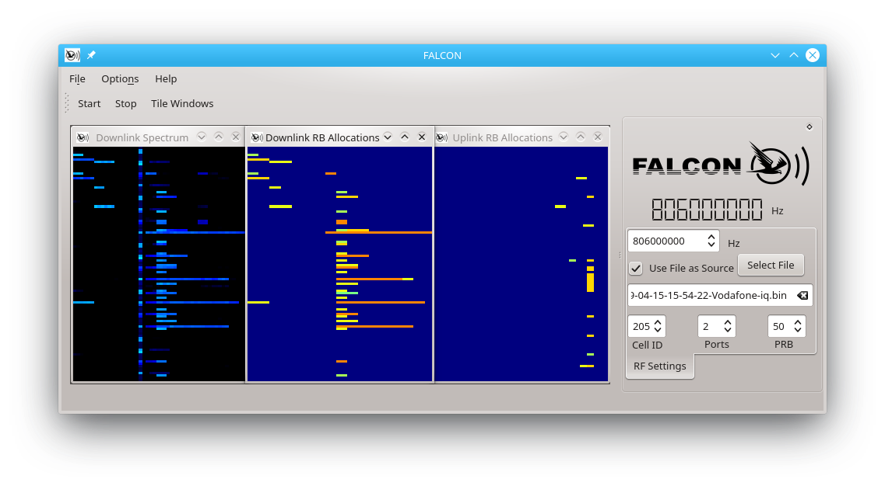

FALCON
========


*Fast Analysis of LTE Control channels* (FALCON) is an open-source software collection for real-time analysis of radio resources in private or commercial LTE/LTE-A networks. Based on srsLTE library v18.12 (https://github.com/srsLTE/srsLTE), the software can be run on a plain x86 general purpose PCs with any compatible SDR.

The software is an alternative to IMDEA OWL (https://git.networks.imdea.org/nicola_bui/imdeaowl) which provides comparable functionalities for long-term monitoring of LTE cells. Other than OWL, FALCON additionally targets use cases which require short-term monitoring, mobility or non-ideal radio conditions. For conveniance purposes, the interface is mostly kept compatible to OWL and an updated port of OWL is also included into the framework.


FALCON is released under the AGPLv3 license.

The software is currently in BETA development stage.

## Key Features
* Reliable real-time monitoring public LTE cells
* Suitable for short-term and long-term monitoring with non-ideal radio conditions
* Qt-based and OpenGL-accelerated GUI for visualization of allocated resource blocks, spectrogram and cell-specific performance metrics (throughput, number of active users, etc.).
* Synchronized recorder with integrated support for network probing by an auxiliary modem

## Installation

### 1) Required Dependencies
FALCON installation automatically downloads a proper version of srsLTE and c-mnalib as subproject during the build process. Please install the following dependencies which are required by FALCON or its included components:

For srsLTE:
```sh
$ sudo apt-get install build-essential git subversion cmake libboost-system-dev libboost-test-dev libboost-thread-dev libqwt-dev libqt4-dev libfftw3-dev libsctp-dev libconfig-dev libconfig++-dev libmbedtls-dev
```
For srsGUI (optional for GUI of IMDEA OWL):
```sh
$ sudo apt-get install libboost-system-dev libboost-test-dev libboost-thread-dev libqwt-dev libqt4-dev
$ git clone https://github.com/srsLTE/srsGUI.git
$ cd srsgui
$ mkdir build
$ cd build
$ cmake ../
$ make 
$ sudo make install
```
For USRP support:
```sh
$ sudo add-apt-repository ppa:ettusresearch/uhd
$ sudo apt-get update
$ sudo apt-get install libuhd-dev libuhd003 uhd-host
```

For FALCON:
```sh
$ sudo apt-get install libglib2.0-dev libudev-dev libcurl4-gnutls-dev libboost-all-dev qtdeclarative5-dev libqt5charts5-dev
```

### 2) FALCON:
```sh
$ git clone https://github.com/falkenber9/falcon.git
$ cd falcon
$ mkdir build
$ cd build
$ cmake ../
$ make
```

## Usage Instructions
This section provides brief usage instructions for FALCON's software components:

* Falcon Decoder GUI: A visualization for online/offline PDCCH decoding
* FalconEye: A commmand line version of the PDCCH decoder for automated/batch processing
* FalconCaptureProbe: Signal recorder with optional network probing
* FalconCaptureWarden: Command line controller for synchronized recordings by multiple instances of FalconCaptureProbe
* imdea_cc_decoder: Port of IMDEA OWL's PDCCH decoder
* imdea_capture_sync: Port of IMDEA OWL's signal recorder

### FALCON Decoder GUI
The GUI version of FALCON's decoder is located in ``build/src/gui/gui``. Simply launch the executable from terminal or from your preferred graphical file manager.
Enter the center frequency of the target LTE cell or select a recording from a file using the file chooser or drag & drop. Example files are provided in a separate repository (https://github.com/falkenber9/falcon-examples).

Press 'Start' and the decoder immediately starts to synchronize to the cell and decodes the PDCCH.
The GUI will display waterfall plots of the spectrum and resource allocations (uplink and downlink) in real-time. The color of the displayed resource allocations is derived from the individual RNTIs of the particular subscribers.



### FALCON Eye
Command line version of FALCON Decoder. (Instructions and Examples will follow soon.)

### FALCON Capture Probe and Capture Warden
Command line tools for capturing LTE signals and optinal cell probing by an auxiliary modem.
For synchronized recordings by multiple instances of the recorder, Capture Warden provides a test-based command prompt.

Note: In order to reduce the IO-load of the capturing system, FalconCaptureProbe will store the captured samples in RAM and write the to file after the capturing has ended.
For this purpose, the application allocates all available RAM (minus 500MB as a reserve) for the internal sample buffer.
The capturing process stops if the allocated buffer size is exceeded.

#### Minimum example: Capture raw data from a cell
In order to capture raw data from an LTE cell and store it on hard disk for later (offline) analysis, launch FALCON Capture Probe as follows:

```sh
$ cd build/src
$ ./FalconCaptureProbe -f <carrier_frequency_Hz> -n <nof_subframes> -o example 
```
* carrier_frequency_Hz: Center frequency in Hz of the LTE cell to capture. Exponential values are also accepted, e.g. ``1845e6``.
* nof_subframe: Number of subframes (= milliseconds) to capture. A value of ``5000`` may be a good start.

If it succeeds, the current working directory will contain the following files:

* ``example-unknownOperator-cell.csv``: General cell information in CSV format
* ``example-unknownOperator-iq.bin``: Raw IQ samples of the cell for later analysis


(Further instructions and Examples will follow soon.)


## Comparison with IMDEA OWL

The interface of FALCON's recorder and decoder is mostly compatible to IMDEA OWL (https://git.networks.imdea.org/nicola_bui/imdeaowl).
FALCON inherits OWL's approach of tracking C-RNTI assignments from PRACH for any UE that joins the cell during the observation time.
However, the method to discover already active C-RNTIs from earlier assignments differ significantly.
FALCON uses RNTI histograms and shortcut decoding to validate unseen RNTIs during the blind decoding procedure.
In contrast to OWL's re-encoding approach, this method is significantly less sensitive to non-ideal radio conditions. This makes FALCON suitable for robust and reliable short-term monitoring, e.g. for mobile applications.

### Port of IMDEA OWL
The original version of IMDEA OWL is hard coded into a fork of SRSLTE v1.3.
In order to provide a fair comparison of FALCON and OWL and their underlying methods, we extracted and ported OWL with its extensions of the SRSLTE library into the FALCON project as separated modules and applications.
By this, both applications benefit from future advancements of SRSLTE library.

### Validation of the port

Every port requires at least slight adaptations of the code, especially if the underlying libraries evolve.
However, this may lead to unintended side effects such as deviant functionality or different handling of exceptions.

We validated the functionality of the IMDEA OWL port against its original implementation by processing the same record of a public LTE cell (IQ samples) with both programs and compared the outputs.

This required the following precautions:

- **Switch Viterbi decoder to 8 bit**: SRSLTE uses 16 bit viterbi decoder if AVX2 is available, whereas the version underlying IMDEA OWL uses 8 bit viterbi decoder. This circumvents direct comparison, since spurious (false) DCI are decoded to different sequences of bits. Therefore, ``#undef VITERBI_16`` in file ``dci.c`` of SRSLTE library even if ``LV_HAVE_AVX2`` is defined to achieve the same behaviour.

With these precautions, both versions decoded and processed the exactly same set of DCI candidates (whether true or spurious). All candidates were classified identically.
However, we noticed the following (minor) differences:

- **DCI scrambled with RA/P/SI-RNTI**: MCS is provided by the updated version. In such cases the old version always reports MCS=0.
- **Swapping**: In case the *Transport Block to Codeword Swap Flag* is set, the related values appear in swapped order.
- **Invalid RB allocation**: If the library detects an illegal RB allocation (i.e. spurious DCI carrying an illegal resource block group assignment), a nulled line is printed. The old version prints arbitrary values.


